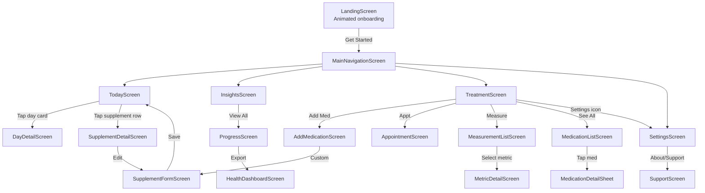
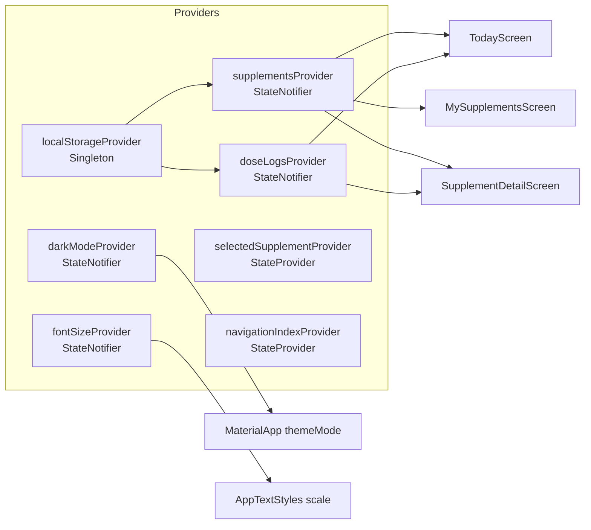
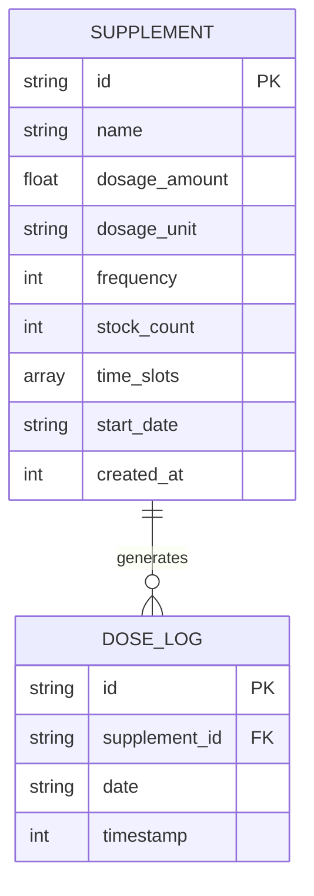
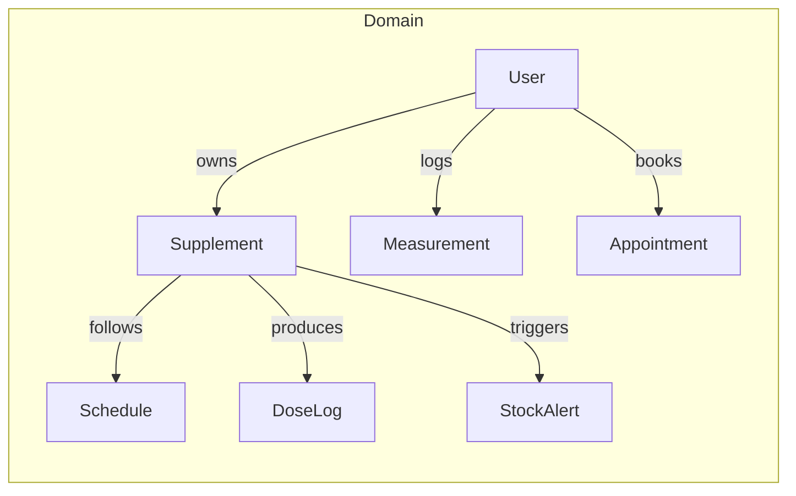
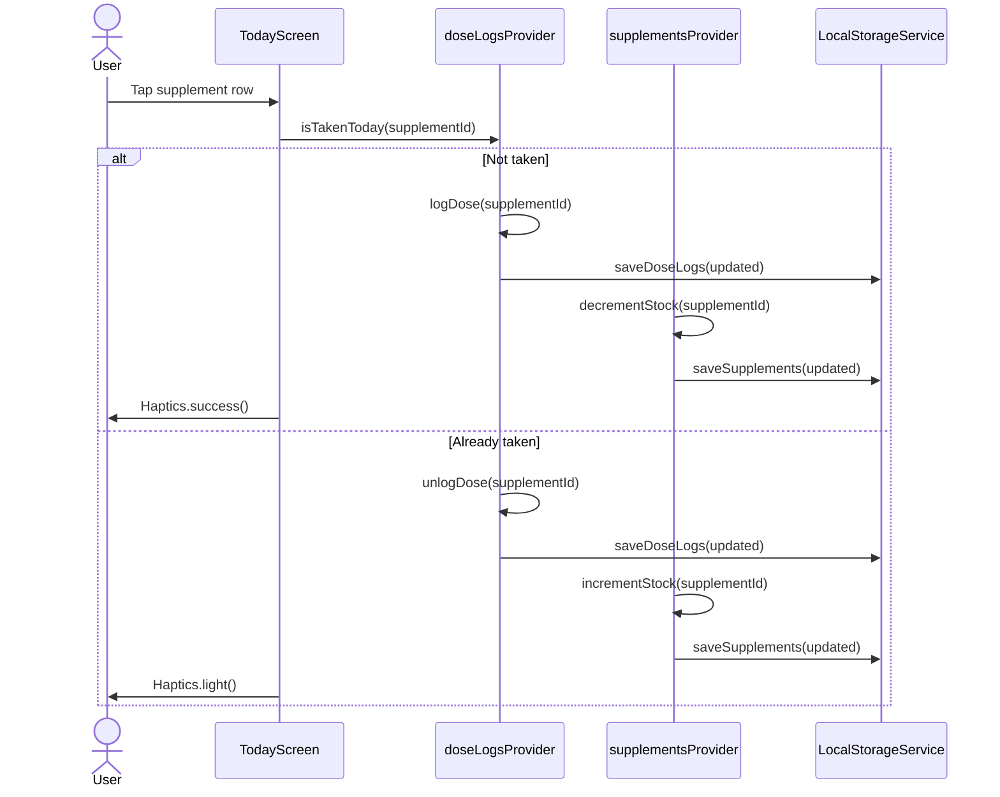
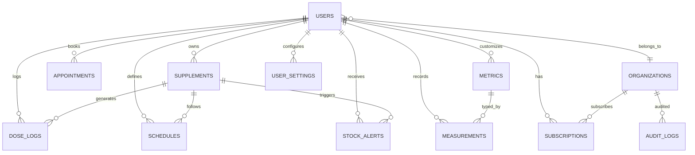

# StackSense / Matra — Technical & Business Architecture Brain

> **Project:** Matra (StackSense) — Supplement & Medication Tracker  
> **Repository:** `matra-dev/Matra`  
> **Working Directory:** `/Users/srikargcv/Developer/miakhalifa`  
> **Document Date:** June 26, 2026  
> **Audience:** Investors, CTOs, engineers, product leads  

---

## 1. Executive Summary

**StackSense** (branded in-app as **Matra**) is a premium, cross-platform mobile application for tracking daily supplement and medication intake, managing personal inventory, and maintaining consistent health routines. The product is positioned at the intersection of **digital health**, **preventive wellness**, and **adherence management**.

### 1.1 What the App Is

- A **personal supplement & medication stack manager** with daily, time-slotted dose tracking.
- A **stock & refill assistant** that warns users before supplies run out.
- An **adherence analytics companion** with weekly trend charts, streaks, and a visual dot-matrix progress language.
- A **health hub** that surfaces appointments, biometric measurements, and (in roadmap form) wearable/Health-Connect integrations.

### 1.2 Target Users

| Segment | Persona | Core Need |
|---------|---------|-----------|
| **Wellness Optimizers** | Health-conscious adults taking 3–10+ supplements daily | Remember doses, avoid missed days, track inventory |
| **Chronic Condition Patients** | Users on recurring prescriptions | Adherence accountability, refill alerts, measurement logging |
| **Biohackers / Athletes** | Quantified-self enthusiasts | Correlating intake with metrics and trends |
| **B2B Wellness Programs** | Corporate wellness / clinics / pharmacies | Aggregate adherence dashboards and population health insights |

### 1.3 Value Proposition

> **“Never miss a dose. Know exactly what you took, when you took it, and when to refill — in a UI that feels like a premium health product.”**

Key differentiators observed in the current build:

- **Liquid-glass / frosted-card visual system** with a custom `Artific` typeface and golden-ratio spacing.
- **Micro-interactions everywhere**: haptic feedback, animated checkboxes, split-capsule icons, staggered list reveals.
- **Offline-first local persistence** via `SharedPreferences`, with a FastAPI + MongoDB backend scaffold ready for cloud sync.
- **Flexible scheduling primitives** already prototyped: interval, multi-daily, specific weekdays, and cyclic (intake/pause) schedules.

---

## 2. Current Tech Stack

### 2.1 Mobile Application (Flutter)

| Layer | Technology | Version / Notes |
|-------|------------|-----------------|
| Framework | Flutter (Dart) | SDK `^3.6.1` |
| State Management | `flutter_riverpod` | `^2.6.1` — `StateNotifierProvider`, `StateProvider` |
| Networking | `dio` | `^5.8.0` — singleton with lazy initialization |
| Charts | `fl_chart` | `^0.70.2` — weekly area/bar charts |
| Animations | `flutter_animate` | `^4.5.2` — declarative entrance/transition animations |
| Haptics | `vibration` | `^3.1.3` + `HapticFeedback` fallback |
| Local Storage | `shared_preferences` | `^2.5.2` — JSON blobs for supplements & dose logs |
| Date Handling | `intl` | `^0.20.2` |
| UUID Generation | `uuid` | `^4.5.1` |
| UI Effects | `blur` | `^4.0.0` — liquid-glass backdrop blur |
| Loading | `shimmer` | `^3.0.0` |
| Icons | `font_awesome_flutter` + Material | `^10.8.0` |
| Dev / Lint | `flutter_lints` | `^5.0.0` |

### 2.2 Backend API (Python)

| Layer | Technology | Version / Notes |
|-------|------------|-----------------|
| Framework | FastAPI | `>=0.136.0` |
| Server | Uvicorn | `>=0.48.0` |
| ODM | Beanie | `>=2.1.0` |
| Async Driver | Motor | `>=3.7.0` |
| Validation | Pydantic v2 | `>=2.13.0` |
| Config | `python-dotenv` | `>=1.0.0` |
| Database | MongoDB | Local (`mongodb://localhost:27017`) or Atlas via `.env` |

### 2.3 Design System

| Asset | Detail |
|-------|--------|
| Typeface | `Artific` (5 weights: 300/400/500/700/900) |
| Color Language | Teal accent (`#00BFA5` light / `#00E5B8` dark), semantic orange/red/blue/purple |
| Spacing | Golden-ratio based `GR` scale (`xs=4`, `sm=8`, `md≈13`, `lg≈21`, `xl≈34`, `xxl≈55`) |
| Components | `GoldenCard`, `GoldenBox`, `GoldenPadding`, `LiquidGlassCard`, `LiquidGlassButton` |
| Theme Modes | Light + Dark, dynamic `ThemeColors.of(context)` |

---

## 3. App Architecture

### 3.1 Folder Structure

```
lib/
├── main.dart                      # App entry, ProviderScope, theme switching
├── models/
│   ├── supplement_model.dart      # Supplement domain entity
│   └── dose_log_model.dart        # DoseLog domain entity
├── providers/
│   └── app_provider.dart          # Riverpod notifiers for supplements & dose logs
├── screens/
│   ├── landing_screen.dart        # Branded animated onboarding
│   ├── main_navigation_screen.dart# 4-tab bottom nav shell
│   ├── today_screen.dart          # Daily dose checklist by time slot
│   ├── insights_screen.dart       # Supplement-level insights (static demo)
│   ├── treatment_screen.dart      # Adherence hero + quick actions
│   ├── progress_screen.dart       # Charts/list adherence history
│   ├── settings_screen.dart       # Notifications, dark mode, about
│   ├── support_screen.dart        # Text size, beta access, team contact
│   ├── my_supplements_screen.dart # Searchable/filterable supplement list
│   ├── supplement_form_screen.dart# Add/edit supplement form
│   ├── supplement_detail_screen.dart # Stats + 7-day chart + edit/delete
│   ├── medication_list_screen.dart# Static demo medication directory
│   ├── add_medication_screen.dart # 3-step medication onboarding wizard
│   ├── appointment_screen.dart    # Book/save appointment with reminders
│   ├── measurement_list_screen.dart# Biometric metric picker
│   ├── metric_detail_screen.dart  # Static demo metric detail
│   ├── health_dashboard_screen.dart# Aggregate health overview dashboard
│   └── day_detail_screen.dart     # Hero-zoomed monthly adherence view
├── services/
│   ├── api_service.dart           # Dio client + REST mapping (currently unused)
│   ├── local_storage_service.dart # SharedPreferences CRUD
│   └── dummy_data.dart            # Seeded demo data
├── theme/
│   ├── app_theme.dart             # Material3 light/dark ThemeData
│   ├── app_colors.dart            # Static palette
│   ├── app_text_styles.dart       # Dynamic type scale + font-size provider
│   ├── app_spacing.dart           # Static spacing tokens
│   └── golden_ratio.dart          # GR scale, GoldenCard, dynamic AppColors
├── utils/
│   ├── app_date_utils.dart        # Date formatting & relative-day helpers
│   └── haptics.dart               # Vibration/haptic wrappers
└── widgets/
    ├── animated_checkbox.dart     # Spring-physics checkmark
    ├── empty_state.dart           # Branded empty/error state
    ├── liquid_glass_card.dart     # Backdrop-blur cards/buttons
    ├── low_stock_badge.dart       # Stock warning chip
    ├── split_capsule_icon.dart    # Novel split-pill toggle icon
    └── time_slot_chip.dart        # Morning/Afternoon/Evening chips
```

### 3.2 Navigation Architecture



### 3.3 State Management with Riverpod



**Notable patterns:**

- `SupplementsNotifier` seeds dummy data once if local storage is empty.
- `DoseLogsNotifier` maintains only **today’s** logs in state; historical logs are read ad-hoc from `LocalStorageService`.
- `ApiService` exists as a pre-wired singleton but is **not yet connected** to the providers (local-only in current build).

---

## 4. Data Models

### 4.1 Flutter Domain Models

#### `Supplement`

| Field | Dart Type | Business Meaning |
|-------|-----------|------------------|
| `id` | `String` | Client UUID (MongoDB `_id` on sync) |
| `name` | `String` | Supplement or medication name |
| `dosageAmount` | `double` | Numeric dose (e.g., `5000.0`) |
| `dosageUnit` | `String` | `mg`, `mcg`, `IU`, `g`, `ml` |
| `frequency` | `int` | Times per day |
| `stockCount` | `int` | Current inventory count |
| `timeSlots` | `List<String>` | Assigned slots: `Morning`, `Afternoon`, `Evening` |
| `startDate` | `String` | ISO date `yyyy-MM-dd` regimen start |
| `createdAt` | `int` | Epoch ms creation timestamp |

**Computed getters:**

- `isLowStock` → `stockCount <= frequency * 3`
- `dosageText` → formatted string like `“5000 IU”`
- `daysSinceStart` → days between `startDate` and today

#### `DoseLog`

| Field | Dart Type | Business Meaning |
|-------|-----------|------------------|
| `id` | `String` | Log UUID |
| `supplementId` | `String` | FK to `Supplement.id` |
| `date` | `String` | `yyyy-MM-dd` dose date |
| `timestamp` | `int` | Epoch ms when logged |

### 4.2 Serialization Mapping

The Flutter models already anticipate the backend snake_case contract:

| Flutter Field | JSON Key | Backend Field |
|---------------|----------|---------------|
| `dosageAmount` | `dosage_amount` | `dosage_amount` |
| `dosageUnit` | `dosage_unit` | `dosage_unit` |
| `stockCount` | `stock_count` | `stock_count` |
| `timeSlots` | `time_slots` | `time_slots` |
| `startDate` | `start_date` | `start_date` |
| `createdAt` | `created_at` | `created_at` |
| `supplementId` | `supplement_id` | `supplement_id` |

### 4.3 Model Relationships (Current)



---

## 5. Current Backend Analysis

### 5.1 What Exists Today

The backend is a **functional but minimal FastAPI scaffold** with no authentication, no user scoping, and no deployment configuration beyond `.env`.

### 5.2 Entry Point (`backend/app/main.py`)

- Loads `MONGODB_URL` and `DB_NAME` from environment.
- Initializes Beanie with `Supplement` and `DoseLog` document models.
- Registers CORS with `allow_origins=["*"]` (very permissive).
- Mounts two routers: `/supplements`, `/dose-logs`.
- Exposes `/` and `/health`.

### 5.3 Models (`backend/app/models/`)

| Model | Purpose |
|-------|---------|
| `SupplementBase` | Shared Pydantic fields + validation |
| `SupplementCreate` | POST payload |
| `SupplementUpdate` | PATCH-style PUT payload (all optional) |
| `Supplement` | Beanie `Document` |
| `DoseLogBase` / `DoseLogCreate` / `DoseLog` | Same pattern for dose logs |
| `APIResponse` | Uniform `{success, data, message, error}` envelope |

### 5.4 Endpoints (`backend/app/routers/`)

#### `/supplements`

| Method | Route | Description |
|--------|-------|-------------|
| POST | `/supplements` | Create supplement |
| GET | `/supplements` | List all supplements (global) |
| GET | `/supplements/{id}` | Get one supplement |
| PUT | `/supplements/{id}` | Update supplement |
| DELETE | `/supplements/{id}` | Delete supplement + cascade dose logs |

#### `/dose-logs`

| Method | Route | Description |
|--------|-------|-------------|
| POST | `/dose-logs` | Create dose log + decrement stock |
| DELETE | `/dose-logs/{supplement_id}/{date}` | Remove dose log + restore stock |
| GET | `/dose-logs/supplement/{supplement_id}` | Historical logs per supplement |
| GET | `/dose-logs/today/{date}` | All logs for a date |

### 5.5 Backend Gaps (Critical)

| Gap | Risk | Mitigation in Migration |
|-----|------|-------------------------|
| **No user scoping** | All data is global; multi-user impossible | Add `users` table/collection and FK every record |
| **No authentication** | Anyone can read/write all data | Implement JWT / OAuth2 / anonymous auth |
| **No input sanitization** | `time_slots` free text, name unrestricted | Tighten Pydantic patterns, add SQL/NoSQL injection guards |
| **CORS wildcard** | Security exposure in production | Restrict to known app/admin domains |
| **No audit trail** | No record of who changed what | Add `audit_logs` |
| **No soft delete** | Hard deletes lose history | Add `deleted_at` columns |
| **No rate limiting** | Abuse / scraping risk | Add middleware (SlowAPI, Cloudflare) |
| **No sync protocol** | Flutter expects offline-first sync | Build queue + conflict resolution |
| **No appointment/measurement APIs** | Newer screens are static only | Extend schema + endpoints |

---

## 6. Business Logic Brain

### 6.1 Core Domain Entities



### 6.2 Dose-Taking Workflow



### 6.3 Stock & Refill Logic

**Current rule (client-side):**

```
isLowStock = stockCount <= frequency * 3
```

This means a supplement taken 2×/day triggers a low-stock warning when ≤ 6 capsules remain.

**Production enhancement:**

- Replace fixed rule with a configurable `low_stock_threshold` per supplement.
- Compute **days remaining** = `stockCount / frequency`.
- Send push notification when `days_remaining <= user_refill_lead_time` (default 7 days).
- Support “last purchase date” and auto-estimated refill date based on adherence history.

### 6.4 Adherence Calculation

**Current screens show static/demo adherence values.** The production formula should be:

```
adherence_rate = (logged_doses / expected_doses) * 100
expected_doses = Σ supplements frequency over period
```

Per-supplement and per-day adherence:

```
supplement_daily_adherence = min(1, logs_for_supplement_on_date / frequency)
overall_daily_adherence = Σ supplement_daily_adherence / supplement_count
```

Rolling windows: 7-day, 30-day, 90-day, year-to-date.

### 6.5 Appointments Logic

Current `AppointmentScreen` allows:

- Selecting date & time via native pickers.
- Selecting a healthcare professional from a static list.
- Default reminders: 6 PM day-before + 2 hours before appointment.

**Production requirements:**

- Persist appointment to backend `appointments` table.
- Link to provider directory (name, specialty, location, contact).
- Generate local + push notifications at reminder times.
- Add status lifecycle: `scheduled`, `completed`, `cancelled`, `no_show`.

### 6.6 Measurements Logic

Current `MeasurementListScreen` is a static picker. Production should support:

- Metric definitions in `metrics` table (name, unit, normal ranges, icon/color).
- User entries in `measurements` table (value, unit, recorded_at, notes, source).
- Trend charts per metric with goal thresholds.
- Optional import from Apple Health / Google Health Connect.

### 6.7 Notifications Logic

| Notification Type | Trigger | Channel |
|-------------------|---------|---------|
| Daily dose reminder | Per time slot + user reminder time | Local + Push |
| Low stock alert | `stock_count <= threshold` | Push |
| Refill reminder | Estimated days remaining <= lead time | Push + Email |
| Appointment reminder | 6 PM day before, 2 hours before | Push |
| Streak milestone | 7/30/100 day streak | Push + In-app |
| Critical alert | Medications marked critical + DND bypass | Push (critical) |

### 6.8 Dark Mode & Font Size Preferences

- `darkModeProvider` persists a boolean to `@stacksense/dark_mode` in `SharedPreferences`.
- `fontSizeProvider` persists scale to `@stacksense/font_size_level`.
- `AppTextStyles._scale()` combines app setting with system text-scaler, capped at `1.6×`.
- `ThemeColors.of(context)` provides context-aware palette.

**Production note:** sync these preferences to backend `user_settings` for cross-device consistency.

---

## 7. Commercial-Grade Backend Schema Design

> **Recommendation:** Migrate from MongoDB to **PostgreSQL** for transactional integrity, complex relational queries, auditability, and HIPAA/GDPR-friendly tooling. The schema below is designed for PostgreSQL 15+ with UUID primary keys, row-level security (RLS), and partitioned analytics tables.

### 7.1 Entity Relationship Diagram



### 7.2 Table Definitions

#### `users`

```sql
CREATE TABLE users (
    id UUID PRIMARY KEY DEFAULT gen_random_uuid(),
    email VARCHAR(255) UNIQUE,
    phone VARCHAR(32),
    auth_provider VARCHAR(32) NOT NULL DEFAULT 'anonymous', -- anonymous, google, apple, email
    auth_subject VARCHAR(255) UNIQUE,                       -- external provider sub
    display_name VARCHAR(100),
    timezone VARCHAR(64) NOT NULL DEFAULT 'UTC',
    locale VARCHAR(16) DEFAULT 'en-US',
    date_of_birth DATE,
    gender VARCHAR(16),                                     -- optional, for health insights
    onboarding_completed_at TIMESTAMPTZ,
    is_active BOOLEAN NOT NULL DEFAULT TRUE,
    email_verified_at TIMESTAMPTZ,
    created_at TIMESTAMPTZ NOT NULL DEFAULT NOW(),
    updated_at TIMESTAMPTZ NOT NULL DEFAULT NOW(),
    organization_id UUID REFERENCES organizations(id) ON DELETE SET NULL
);

CREATE INDEX idx_users_email ON users(email);
CREATE INDEX idx_users_auth_subject ON users(auth_subject);
CREATE INDEX idx_users_organization ON users(organization_id);
```

#### `user_settings`

```sql
CREATE TABLE user_settings (
    user_id UUID PRIMARY KEY REFERENCES users(id) ON DELETE CASCADE,
    dark_mode BOOLEAN DEFAULT FALSE,
    font_size_scale DECIMAL(3,2) DEFAULT 1.00 CHECK (font_size_scale BETWEEN 0.80 AND 1.60),
    daily_reminders_enabled BOOLEAN DEFAULT TRUE,
    low_stock_alerts_enabled BOOLEAN DEFAULT TRUE,
    appointment_reminders_enabled BOOLEAN DEFAULT TRUE,
    reminder_lead_time_minutes INT DEFAULT 30,
    refill_lead_time_days INT DEFAULT 7,
    week_starts_on INT DEFAULT 0 CHECK (week_starts_on BETWEEN 0 AND 6), -- 0=Sunday
    updated_at TIMESTAMPTZ NOT NULL DEFAULT NOW()
);
```

#### `supplements`

```sql
CREATE TABLE supplements (
    id UUID PRIMARY KEY DEFAULT gen_random_uuid(),
    user_id UUID NOT NULL REFERENCES users(id) ON DELETE CASCADE,
    name VARCHAR(120) NOT NULL,
    dosage_amount DECIMAL(10,3) NOT NULL CHECK (dosage_amount > 0),
    dosage_unit VARCHAR(10) NOT NULL CHECK (dosage_unit IN ('mg','mcg','IU','g','ml','mcg_RAE','CFU')),
    frequency INT NOT NULL CHECK (frequency BETWEEN 1 AND 20),
    stock_count INT NOT NULL DEFAULT 0 CHECK (stock_count >= 0),
    low_stock_threshold INT NOT NULL DEFAULT 3,
    remind_refill BOOLEAN DEFAULT TRUE,
    critical_alerts BOOLEAN DEFAULT FALSE,
    form VARCHAR(32),                                       -- tablet, capsule, softgel, powder, liquid
    taken_with VARCHAR(50),                                 -- food, water, empty stomach
    instructions TEXT,
    start_date DATE NOT NULL,
    is_active BOOLEAN NOT NULL DEFAULT TRUE,
    deleted_at TIMESTAMPTZ,
    created_at TIMESTAMPTZ NOT NULL DEFAULT NOW(),
    updated_at TIMESTAMPTZ NOT NULL DEFAULT NOW()
);

CREATE INDEX idx_supplements_user ON supplements(user_id);
CREATE INDEX idx_supplements_active ON supplements(user_id, is_active) WHERE deleted_at IS NULL;
CREATE INDEX idx_supplements_low_stock ON supplements(user_id, stock_count, low_stock_threshold) WHERE deleted_at IS NULL;
```

#### `schedules`

```sql
CREATE TABLE schedules (
    id UUID PRIMARY KEY DEFAULT gen_random_uuid(),
    user_id UUID NOT NULL REFERENCES users(id) ON DELETE CASCADE,
    supplement_id UUID NOT NULL REFERENCES supplements(id) ON DELETE CASCADE,
    schedule_type VARCHAR(32) NOT NULL CHECK (schedule_type IN ('interval_hours','interval_days','multiple_daily','specific_days','cyclic')),
    interval_value INT CHECK (interval_value > 0),
    multiple_times INT CHECK (multiple_times BETWEEN 1 AND 20),
    specific_days INT[] DEFAULT '{}',                      -- bitmask or array 0-6
    cyclic_intake_days INT CHECK (cyclic_intake_days > 0),
    cyclic_pause_days INT CHECK (cyclic_pause_days >= 0),
    start_time TIME,
    end_time TIME,
    dose_quantity INT NOT NULL DEFAULT 1 CHECK (dose_quantity > 0),
    timezone VARCHAR(64) NOT NULL DEFAULT 'UTC',
    is_active BOOLEAN NOT NULL DEFAULT TRUE,
    created_at TIMESTAMPTZ NOT NULL DEFAULT NOW(),
    updated_at TIMESTAMPTZ NOT NULL DEFAULT NOW()
);

CREATE INDEX idx_schedules_supplement ON schedules(supplement_id);
CREATE INDEX idx_schedules_user ON schedules(user_id);
```

#### `dose_logs`

```sql
CREATE TABLE dose_logs (
    id UUID PRIMARY KEY DEFAULT gen_random_uuid(),
    user_id UUID NOT NULL REFERENCES users(id) ON DELETE CASCADE,
    supplement_id UUID NOT NULL REFERENCES supplements(id) ON DELETE CASCADE,
    schedule_id UUID REFERENCES schedules(id) ON DELETE SET NULL,
    date DATE NOT NULL,
    logged_at TIMESTAMPTZ NOT NULL DEFAULT NOW(),
    timezone VARCHAR(64) NOT NULL DEFAULT 'UTC',
    dose_quantity INT NOT NULL DEFAULT 1,
    source VARCHAR(32) DEFAULT 'app_manual',                -- app_manual, reminder, widget, import
    deleted_at TIMESTAMPTZ
);

CREATE INDEX idx_dose_logs_user_date ON dose_logs(user_id, date DESC);
CREATE INDEX idx_dose_logs_supplement_date ON dose_logs(supplement_id, date DESC);
CREATE INDEX idx_dose_logs_logged_at ON dose_logs(logged_at DESC);
```

#### `stock_alerts`

```sql
CREATE TABLE stock_alerts (
    id UUID PRIMARY KEY DEFAULT gen_random_uuid(),
    user_id UUID NOT NULL REFERENCES users(id) ON DELETE CASCADE,
    supplement_id UUID NOT NULL REFERENCES supplements(id) ON DELETE CASCADE,
    alert_type VARCHAR(32) NOT NULL CHECK (alert_type IN ('low_stock','out_of_stock','refill_due')),
    threshold_value INT,
    stock_count_at_alert INT NOT NULL,
    is_resolved BOOLEAN NOT NULL DEFAULT FALSE,
    resolved_at TIMESTAMPTZ,
    created_at TIMESTAMPTZ NOT NULL DEFAULT NOW()
);

CREATE INDEX idx_stock_alerts_user ON stock_alerts(user_id, is_resolved);
CREATE INDEX idx_stock_alerts_supplement ON stock_alerts(supplement_id);
```

#### `appointments`

```sql
CREATE TABLE appointments (
    id UUID PRIMARY KEY DEFAULT gen_random_uuid(),
    user_id UUID NOT NULL REFERENCES users(id) ON DELETE CASCADE,
    provider_name VARCHAR(120) NOT NULL,
    provider_specialty VARCHAR(64),
    provider_phone VARCHAR(32),
    provider_location TEXT,
    scheduled_at TIMESTAMPTZ NOT NULL,
    timezone VARCHAR(64) NOT NULL DEFAULT 'UTC',
    status VARCHAR(32) NOT NULL DEFAULT 'scheduled' CHECK (status IN ('scheduled','completed','cancelled','no_show')),
    notes TEXT,
    reminder_day_before_sent BOOLEAN DEFAULT FALSE,
    reminder_hours_before_sent BOOLEAN DEFAULT FALSE,
    created_at TIMESTAMPTZ NOT NULL DEFAULT NOW(),
    updated_at TIMESTAMPTZ NOT NULL DEFAULT NOW()
);

CREATE INDEX idx_appointments_user_time ON appointments(user_id, scheduled_at);
CREATE INDEX idx_appointments_status ON appointments(user_id, status) WHERE status IN ('scheduled');
```

#### `metrics`

```sql
CREATE TABLE metrics (
    id UUID PRIMARY KEY DEFAULT gen_random_uuid(),
    user_id UUID REFERENCES users(id) ON DELETE CASCADE,  -- NULL = system-defined global metric
    name VARCHAR(80) NOT NULL,
    unit VARCHAR(32) NOT NULL,
    category VARCHAR(32),                                   -- vitals, lab, activity, sleep, body
    normal_min DECIMAL(10,3),
    normal_max DECIMAL(10,3),
    goal_min DECIMAL(10,3),
    goal_max DECIMAL(10,3),
    is_active BOOLEAN NOT NULL DEFAULT TRUE,
    icon VARCHAR(32),
    color_hex CHAR(7),
    created_at TIMESTAMPTZ NOT NULL DEFAULT NOW()
);

CREATE INDEX idx_metrics_user_global ON metrics(user_id, is_active);
```

#### `measurements`

```sql
CREATE TABLE measurements (
    id UUID PRIMARY KEY DEFAULT gen_random_uuid(),
    user_id UUID NOT NULL REFERENCES users(id) ON DELETE CASCADE,
    metric_id UUID NOT NULL REFERENCES metrics(id) ON DELETE CASCADE,
    value DECIMAL(12,4) NOT NULL,
    unit VARCHAR(32) NOT NULL,
    recorded_at TIMESTAMPTZ NOT NULL DEFAULT NOW(),
    timezone VARCHAR(64) NOT NULL DEFAULT 'UTC',
    notes TEXT,
    source VARCHAR(32) DEFAULT 'manual',                    -- manual, health_connect, apple_health, device
    deleted_at TIMESTAMPTZ
);

CREATE INDEX idx_measurements_user_metric ON measurements(user_id, metric_id, recorded_at DESC);
CREATE INDEX idx_measurements_recorded ON measurements(recorded_at DESC);
```

#### `organizations`

```sql
CREATE TABLE organizations (
    id UUID PRIMARY KEY DEFAULT gen_random_uuid(),
    name VARCHAR(120) NOT NULL,
    slug VARCHAR(60) UNIQUE NOT NULL,
    type VARCHAR(32) NOT NULL CHECK (type IN ('corporate','clinic','pharmacy','insurer','research')),
    admin_user_id UUID REFERENCES users(id),
    settings JSONB DEFAULT '{}',
    created_at TIMESTAMPTZ NOT NULL DEFAULT NOW(),
    updated_at TIMESTAMPTZ NOT NULL DEFAULT NOW()
);

CREATE INDEX idx_organizations_slug ON organizations(slug);
```

#### `subscriptions`

```sql
CREATE TABLE subscriptions (
    id UUID PRIMARY KEY DEFAULT gen_random_uuid(),
    user_id UUID REFERENCES users(id) ON DELETE SET NULL,
    organization_id UUID REFERENCES organizations(id) ON DELETE SET NULL,
    plan VARCHAR(32) NOT NULL CHECK (plan IN ('free','premium','family','enterprise')),
    status VARCHAR(32) NOT NULL DEFAULT 'active' CHECK (status IN ('active','cancelled','past_due','trialing')),
    started_at TIMESTAMPTZ NOT NULL DEFAULT NOW(),
    expires_at TIMESTAMPTZ,
    payment_provider VARCHAR(32),
    payment_subscription_id VARCHAR(255),
    metadata JSONB DEFAULT '{}',
    created_at TIMESTAMPTZ NOT NULL DEFAULT NOW(),
    updated_at TIMESTAMPTZ NOT NULL DEFAULT NOW(),
    CHECK (user_id IS NOT NULL OR organization_id IS NOT NULL)
);

CREATE INDEX idx_subscriptions_user ON subscriptions(user_id, status);
CREATE INDEX idx_subscriptions_org ON subscriptions(organization_id, status);
```

#### `audit_logs`

```sql
CREATE TABLE audit_logs (
    id UUID PRIMARY KEY DEFAULT gen_random_uuid(),
    user_id UUID REFERENCES users(id) ON DELETE SET NULL,
    organization_id UUID REFERENCES organizations(id) ON DELETE SET NULL,
    actor_type VARCHAR(16) NOT NULL CHECK (actor_type IN ('user','system','admin')),
    action VARCHAR(64) NOT NULL,                            -- supplement.created, dose_logged, etc.
    entity_type VARCHAR(64) NOT NULL,
    entity_id UUID,
    payload JSONB,
    ip_address INET,
    user_agent TEXT,
    created_at TIMESTAMPTZ NOT NULL DEFAULT NOW()
) PARTITION BY RANGE (created_at);

CREATE INDEX idx_audit_logs_user ON audit_logs(user_id, created_at DESC);
CREATE INDEX idx_audit_logs_entity ON audit_logs(entity_type, entity_id, created_at DESC);
```

**Partitioning:** monthly partitions `audit_logs_y2026m06`, etc.

#### `analytics_events`

```sql
CREATE TABLE analytics_events (
    id UUID PRIMARY KEY DEFAULT gen_random_uuid(),
    user_id UUID REFERENCES users(id) ON DELETE SET NULL,
    event_name VARCHAR(64) NOT NULL,
    properties JSONB DEFAULT '{}',
    session_id UUID,
    device_platform VARCHAR(16),
    app_version VARCHAR(20),
    created_at TIMESTAMPTZ NOT NULL DEFAULT NOW()
) PARTITION BY RANGE (created_at);

CREATE INDEX idx_analytics_event_name ON analytics_events(event_name, created_at DESC);
CREATE INDEX idx_analytics_user ON analytics_events(user_id, created_at DESC);
```

### 7.3 Constraints Summary

| Table | Key Constraints |
|-------|-----------------|
| `users` | UUID PK, unique email, unique auth_subject, FK to `organizations` |
| `supplements` | FK to `users`, soft delete, positive dosage/frequency/stock |
| `schedules` | FK to `user` + `supplement`, schedule_type enum |
| `dose_logs` | FK to `user` + `supplement` + optional `schedule`, date index |
| `stock_alerts` | FK to `user` + `supplement`, alert_type enum |
| `appointments` | FK to `user`, status enum, timezone-aware |
| `measurements` | FK to `user` + `metric`, value precision |
| `subscriptions` | FK to `user` OR `organization`, plan/status enums |
| `audit_logs` | Partitioned by month, immutable event record |

---

## 8. API Design

### 8.1 Base URL & Conventions

```
https://api.stacksense.app/v1
```

- JSON request/response bodies.
- Standard envelope: `{ "success": bool, "data": any, "message": string?, "error": string? }`.
- Auth: `Authorization: Bearer <JWT>`.
- Pagination: `?page=1&limit=20`.
- Timezone: `X-Client-Timezone: Asia/Kolkata`.

### 8.2 Authentication

| Method | Endpoint | Description |
|--------|----------|-------------|
| POST | `/auth/anonymous` | Create anonymous user (device_id) |
| POST | `/auth/email/signup` | Email + password registration |
| POST | `/auth/email/login` | Email + password login |
| POST | `/auth/oauth/{provider}` | Google / Apple OAuth exchange |
| POST | `/auth/refresh` | Refresh access token |
| POST | `/auth/logout` | Revoke refresh token |

### 8.3 Users & Settings

| Method | Endpoint | Description |
|--------|----------|-------------|
| GET | `/me` | Current user profile |
| PATCH | `/me` | Update profile |
| GET | `/me/settings` | User preferences |
| PATCH | `/me/settings` | Update preferences |
| DELETE | `/me` | GDPR data deletion request |

### 8.4 Supplements

| Method | Endpoint | Description |
|--------|----------|-------------|
| GET | `/supplements` | List user’s supplements |
| POST | `/supplements` | Create supplement |
| GET | `/supplements/{id}` | Get supplement |
| PATCH | `/supplements/{id}` | Update supplement |
| DELETE | `/supplements/{id}` | Soft delete supplement |
| POST | `/supplements/{id}/refill` | Add stock (e.g., +30) |

### 8.5 Schedules

| Method | Endpoint | Description |
|--------|----------|-------------|
| GET | `/supplements/{id}/schedules` | Schedules for a supplement |
| POST | `/supplements/{id}/schedules` | Add schedule |
| PATCH | `/schedules/{id}` | Update schedule |
| DELETE | `/schedules/{id}` | Deactivate schedule |

### 8.6 Dose Logs

| Method | Endpoint | Description |
|--------|----------|-------------|
| GET | `/dose-logs` | Query logs (date range, supplement) |
| POST | `/dose-logs` | Log a dose |
| DELETE | `/dose-logs/{id}` | Undo a dose log |
| GET | `/dose-logs/today` | Today’s logs |
| GET | `/dose-logs/adherence` | Adherence summary (7/30/90d) |

### 8.7 Stock Alerts

| Method | Endpoint | Description |
|--------|----------|-------------|
| GET | `/stock-alerts` | Active alerts |
| PATCH | `/stock-alerts/{id}/resolve` | Mark resolved |

### 8.8 Appointments

| Method | Endpoint | Description |
|--------|----------|-------------|
| GET | `/appointments` | List appointments |
| POST | `/appointments` | Create appointment |
| GET | `/appointments/{id}` | Get appointment |
| PATCH | `/appointments/{id}` | Update status |
| DELETE | `/appointments/{id}` | Cancel |

### 8.9 Measurements

| Method | Endpoint | Description |
|--------|----------|-------------|
| GET | `/metrics` | System + user metrics |
| POST | `/metrics` | Create custom metric |
| GET | `/measurements` | List measurements |
| POST | `/measurements` | Record measurement |
| GET | `/measurements/{metric_id}/trend` | Trend data for charts |

### 8.10 Analytics & Admin

| Method | Endpoint | Description |
|--------|----------|-------------|
| POST | `/analytics/events` | Batch ingest mobile events |
| GET | `/admin/organizations/{id}/users` | B2B user list |
| GET | `/admin/organizations/{id}/adherence` | Aggregate adherence report |
| GET | `/admin/audit-logs` | Audit trail (admin only) |

---

## 9. Business Model Recommendations

### 9.1 Revenue Streams

| Stream | Model | Description |
|--------|-------|-------------|
| **Freemium Subscriptions** | B2C | Free: up to 3 supplements, basic reminders. Premium: unlimited supplements, advanced analytics, Health Connect, family sharing. |
| **B2B Wellness Programs** | SaaS | Per-employee-per-month (PEPM) licensing for corporate wellness, clinics, insurers. |
| **Pharmacy Integrations** | Affiliate / API | Partner pharmacies for 1-tap refill ordering; revenue share per order. |
| **Affiliate Supplement Revenue** | Affiliate | Curated supplement recommendations with tracked referral links. |
| **Premium Insights** | Add-on | Personalized reports (e.g., “Your 90-day adherence report”), export to PDF/CSV. |
| **Data Licensing (Aggregated)** | Research | Anonymized adherence datasets for public health / research (with explicit consent). |

### 9.2 Suggested Pricing Tiers

| Tier | Monthly | Annual | Features |
|------|---------|--------|----------|
| Free | $0 | $0 | 3 supplements, daily reminders, basic stock alerts |
| Premium | $4.99 | $39.99 | Unlimited, schedules, Health Connect, export, insights |
| Family | $8.99 | $79.99 | Up to 5 profiles, shared stack management |
| Enterprise | Custom | Custom | Admin dashboard, SSO, aggregate reporting, API access |

### 9.3 Key Metrics to Track

| Metric | Why It Matters |
|--------|----------------|
| DAU / MAU | Engagement with daily health routine |
| Doses Logged / User / Day | Core value delivery |
| 7-Day Adherence Rate | Health outcome proxy |
| Refill Conversion Rate | Pharmacy/affiliate monetization |
| Premium Conversion Rate | Subscription health |
| CAC / LTV | Unit economics |
| Churn by Adherence Bucket | Identify at-risk users |

---

## 10. Scalability & Security

### 10.1 Authentication & Authorization

- **JWT access tokens** (15 min TTL) + **refresh tokens** (stored hashed in DB).
- **Anonymous auth** for zero-friction onboarding; gradual identity binding.
- **OAuth2** for Google/Apple Sign-In.
- **Row-Level Security (RLS)** in PostgreSQL to enforce user scoping.
- **Role-based access** for admin/org endpoints.

### 10.2 Data Protection

| Concern | Control |
|---------|---------|
| Encryption at rest | PostgreSQL TDE / cloud-managed encryption |
| Encryption in transit | TLS 1.3 for all API traffic |
| Sensitive fields | Encrypt `phone`, `date_of_birth`, provider notes at application layer |
| PII minimization | Only collect fields necessary for service |
| Right to deletion | `/me` DELETE triggers async data purge workflow |
| Data portability | Export endpoints (JSON/CSV/PDF) |

### 10.3 Regulatory Considerations

| Regulation | Relevance | Action Items |
|------------|-----------|--------------|
| **HIPAA (US)** | If handling PHI for covered entities | BAA with cloud provider, audit logs, access controls, encryption |
| **GDPR (EU)** | EU users | Consent flows, DPO, data processing agreements, right to erasure |
| **FDA / HMD** | If making medical claims | Avoid disease-treatment claims; frame as wellness/adherence support |
| **App Store / Play Store** | Health apps | Privacy nutrition label, data use disclosure |

### 10.4 Data Retention

| Data Type | Retention |
|-----------|-----------|
| Dose logs | 7 years (health record) |
| Measurements | 7 years |
| Appointments | 7 years |
| Audit logs | 2 years (then archive to cold storage) |
| Analytics events | 1 year (then aggregate + delete) |
| Deleted accounts | 30-day grace period, then hard delete |

### 10.5 Scalability Roadmap

| Phase | Scale | Architecture |
|-------|-------|--------------|
| **MVP** | 1K users | Single API + managed PostgreSQL |
| **Growth** | 100K users | Read replicas, Redis cache, CDN for static assets |
| **Scale** | 1M+ users | Horizontal API pods, sharded analytics events, separate notification service |
| **Global** | Multi-region | Regional read replicas, localized notification workers |

### 10.6 Operational Security Checklist

- [ ] Dependabot / Snyk scanning for Flutter and Python dependencies.
- [ ] Secrets management (AWS Secrets Manager / GCP Secret Manager / Azure Key Vault).
- [ ] Rate limiting per user/IP.
- [ ] Input validation on all endpoints (Pydantic v2 + SQL injection guards).
- [ ] OWASP Mobile Top 10 review for Flutter app.
- [ ] Annual penetration testing.
- [ ] Incident response playbook.

---

## 11. Migration Path

### 11.1 Phase 1: Stabilize Local-First Foundation (Weeks 1–2)

1. Fix `MetricDetailScreen` duplicate `final tc` declarations.
2. Unify static vs. dynamic color usage (`AppColors` vs `ThemeColors`).
3. Convert demo-only screens (`InsightsScreen`, `MetricDetailScreen`, `TreatmentScreen`, `ProgressScreen`, `MedicationListScreen`) to consume real providers.
4. Add unit tests for `SupplementsNotifier`, `DoseLogsNotifier`, and `Supplement` model getters.
5. Implement proper error boundaries and retry flows.

### 11.2 Phase 2: Production Backend Build (Weeks 3–6)

1. Provision PostgreSQL (Supabase / AWS RDS / Cloud SQL).
2. Implement `users`, `user_settings`, `supplements`, `schedules`, `dose_logs` tables.
3. Add JWT auth service (anonymous + email + OAuth).
4. Rewrite FastAPI routers to use SQLAlchemy 2.0 async + Pydantic v2.
5. Add audit logging middleware.
6. Deploy to container platform (Cloud Run / ECS / Kubernetes).

### 11.3 Phase 3: Sync Engine (Weeks 7–8)

1. Add local SQLite queue for pending operations (insert/update/delete).
2. Implement background sync with connectivity detection.
3. Conflict resolution: **last-write-wins per entity**, with server timestamp.
4. Add sync status indicator in UI.
5. Seed existing `SharedPreferences` data into backend on first login.

### 11.4 Phase 4: Notifications & Engagement (Weeks 9–10)

1. Integrate Firebase Cloud Messaging (FCM) + APNs.
2. Build notification service worker for dose reminders, stock alerts, appointment reminders.
3. Support critical alerts for iOS.
4. A/B test reminder timing.

### 11.5 Phase 5: B2B & Monetization (Weeks 11–14)

1. Build Flutter Web admin dashboard.
2. Implement `organizations`, `subscriptions`, and aggregate reporting APIs.
3. Integrate Stripe / RevenueCat for billing.
4. Pharmacy/refill partner API pilots.

### 11.6 Data Migration Script (Pseudocode)

```python
# One-time migration from SharedPreferences JSON to PostgreSQL
async def migrate_local_user(device_id: str, supplements: list, logs: list):
    user = await create_anonymous_user(device_id=device_id)
    for s in supplements:
        supp = await Supplement.create(
            user_id=user.id,
            name=s["name"],
            dosage_amount=s["dosage_amount"],
            dosage_unit=s["dosage_unit"],
            frequency=s["frequency"],
            stock_count=s["stock_count"],
            time_slots=s["time_slots"],
            start_date=s["start_date"],
            created_at=datetime.fromtimestamp(s["created_at"] / 1000),
        )
        # Create a default schedule from legacy time_slots/frequency
        await Schedule.create_from_legacy(supp)
    for log in logs:
        await DoseLog.create(
            user_id=user.id,
            supplement_id=map_old_to_new(log["supplement_id"]),
            date=log["date"],
            logged_at=datetime.fromtimestamp(log["timestamp"] / 1000),
        )
```

---

## 12. Appendix: Current Build Observations

### 12.1 Strengths

- Polished, cohesive design language with consistent motion design.
- Solid offline-first architecture for core supplement tracking.
- Backend scaffold is clean and follows FastAPI best practices.
- Provider architecture is testable and ready for API integration.

### 12.2 Immediate Risks

- Multiple screens are still hard-coded demos (static medications, adherence values, charts).
- No user scoping or auth in backend.
- Wildcard CORS.
- `ApiService` is written but not wired into providers.
- Minor Dart errors (`MetricDetailScreen` duplicate variable).

### 12.3 Recommended Next Commit Priorities

1. Wire `ApiService` behind a feature flag and connect providers.
2. Add `user_id` scoping to all backend endpoints.
3. Replace static demo data in `TreatmentScreen`, `InsightsScreen`, `ProgressScreen` with real providers.
4. Tighten CORS and add rate limiting.
5. Add a `schedules` collection/table to support the advanced scheduling UI already built in `AddMedicationScreen`.

---

*Document generated by codebase analysis on June 26, 2026.*
